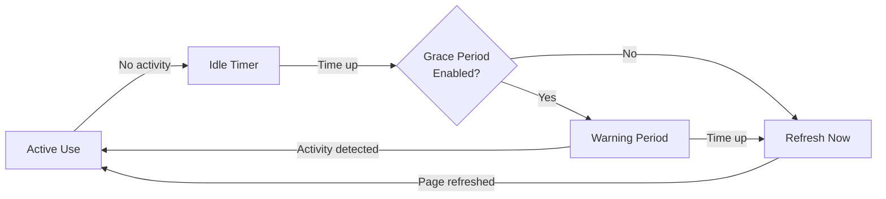

# Auto Refresh

Ever walked away from your computer for a coffee break, only to come back and find DeepSeek logged you out? Or maybe you've had those mysterious "out of memory" errors after keeping a session open for too long? Auto Refresh is here to save the day by keeping your DeepSeek session fresh and active.

## Why It Exists

DeepSeek's web interface, like many web applications, has some built-in safeguards that can interrupt your roleplay sessions:

**Session Timeouts** happen when DeepSeek thinks you've been idle too long. The site logs you out or requires you to refresh the page, which means IntenseRP Next loses its connection and you have to restart everything.

**Memory Issues** can occur when the browser tab accumulates too much data over time. This is especially true if you're swapping between multiple chats frequently or running very long sessions. A periodic refresh clears this buildup.

!!! info "The Solution"
    Auto Refresh periodically refreshes the DeepSeek page in the background, resetting these timers and clearing memory before problems occur. It's like giving your browser a quick stretch to stay limber.

## How It Works

The refresh system follows a simple flow that respects what you're doing:



### :material-timer-sand: The Idle Timer

While you're actively chatting, the timer constantly resets. Every message you send, every button you click - it all counts as activity. Once you stop interacting, the countdown begins.

After your configured idle time (default 5 minutes), the system decides it's time for a refresh. But it doesn't just yank the rug out from under you...

### :material-hand-front-left: The Grace Period

If you have the grace period enabled (which you should), the system gives you a heads-up before refreshing. You'll see a message in the console like:

```
No activity for 5 minutes. Page will refresh in 25 seconds unless activity is detected.
```

This is your chance to send a message or click something if you're still there. Any activity during this grace period cancels the refresh and resets everything.

### :material-refresh: The Refresh

When the refresh happens, IntenseRP Next:

1. Refreshes the DeepSeek page in the browser
2. Waits for it to load completely
3. Checks if you're still logged in
4. Re-authenticates if needed (with auto-login enabled)
5. Resumes normal operation

The whole process usually takes just a few seconds, and then you're back in business.

## Setting It Up

Head to **Settings** → **Advanced Settings** and look for the Auto Refresh section:

### :material-toggle-switch: Auto Refresh Page

The master switch. Turn this on to enable the entire system. When it's off, no refreshing happens at all.

### :material-clock-outline: Idle Timeout

How many minutes of inactivity before considering a refresh. The default of 5 minutes works well for most people.

- **Lower values** (1-3 minutes) are more aggressive but might refresh too often
- **Medium values** (4-7 minutes) balance safety with convenience
- **Higher values** (8+ minutes) give you more time but risk hitting timeouts

### :material-timer-outline: Grace Period

How many seconds to wait after the idle timeout before actually refreshing. Default is 25 seconds.

- **Short grace** (5-15 seconds) gives a quick warning
- **Medium grace** (20-40 seconds) provides reasonable reaction time
- **Long grace** (60+ seconds) is very forgiving but delays the refresh

### :material-toggle-switch-off-outline: Use Grace Period

Controls whether you get that warning period or not. With this off, the page refreshes immediately when the idle timer expires.

!!! tip "Keep It On"
    Unless you have a specific reason, leave the grace period enabled. It's much less jarring to get a warning than to have the page suddenly refresh while you're thinking about your next message.

### :material-dice-6: Humanize Timing

Adds subtle randomization (±5 seconds) to refresh intervals to make the timing less predictable and more natural.

When enabled, each refresh cycle gets slightly different timing - sometimes your 5-minute idle timeout might be 4 minutes 57 seconds, other times it could be 5 minutes 3 seconds. This applies to both the idle timeout and grace period.

!!! info "Why Randomize?"
    Predictable timing patterns can sometimes trigger detection systems or just feel too robotic. The randomization makes refresh behavior feel more natural while still maintaining the safety benefits of auto refresh.

## Recommended Settings

For most users, these settings work great:

| Setting | Recommended Value | Why |
|---------|------------------|-----|
| **Auto Refresh** | :material-toggle-switch: ON | Prevents timeout issues |
| **Idle Timeout** | 5 minutes | Good balance of safety and convenience |
| **Grace Period** | 25 seconds | Enough time to cancel if needed |
| **Use Grace Period** | :material-toggle-switch: ON | Gives you control over when refreshes happen |
| **Humanize Timing** | :material-toggle-switch-off: OFF | Optional - enables more natural timing patterns |

!!! example "Heavy User Settings"
    If you're doing marathon roleplay sessions or leaving IntenseRP Next running all day:
    
    - **Idle Timeout**: 3 minutes (more aggressive)
    - **Grace Period**: 15 seconds (quicker refresh cycle)
    
    This keeps everything fresh without being too disruptive.

## What You'll See

When auto refresh is active, you'll notice these messages in the console:

**During normal use:**
```
Activity recorded - refresh timer reset
```

**When idle timeout is reached (with grace period):**
```
No activity for 5 minutes. Page will refresh in 25 seconds unless activity is detected.
```

**If you become active during grace period:**
```
Activity detected during grace period - refresh cancelled
```

**When refresh happens:**
```
Refreshing page to prevent session timeout...
Page refresh successful - chat interface ready
```

## Things to Know

The refresh happens in the browser window that IntenseRP Next controls. Your SillyTavern connection stays intact, and no refreshes will happen mid-response.

If you're in the middle of generating a response when the idle timer triggers, the activity from the response generation will reset the timer. The system is smart enough not to interrupt active conversations.

Auto-login works seamlessly with auto refresh. If the refresh logs you out (rare but possible), IntenseRP Next will automatically log you back in using your saved credentials.

!!! warning "Browser Window Required"
    Auto refresh only works while the browser window is open. If you close the browser or stop IntenseRP Next, the refresh timer stops too. This is by design - no background processes running when you don't need them.

## When to Disable It

There are a few scenarios where you might want to turn off auto refresh:

- You're debugging something and need the page to stay in a specific state
- You have an extremely stable connection and never experience timeouts
- You're only doing very short sessions and don't leave the app idle

For everyone else, auto refresh is a set-it-and-forget-it feature that prevents those annoying disconnections and keeps your roleplay sessions running smoothly.

---

!!! question "Still Getting Timeouts?"
    If you're getting logged out even with auto refresh enabled, try decreasing the idle timeout to 3 minutes. Some network configurations or VPNs might cause DeepSeek to be more aggressive with timeouts.


---

!!! note "Future Improvements"
    Despite being advanced, this feature is still very new and in active development. Expect updates and changes as we get more feedback from users.

    In the near future, at least these improvements are planned:

    - Forced refreshes when the memory "runs out"
    - Better notifications for upcoming refreshes (not just console messages)