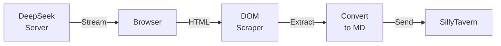
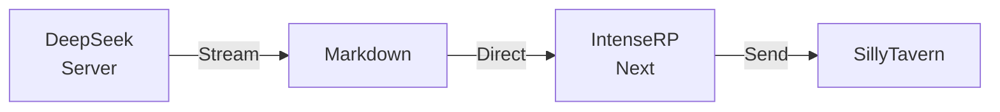
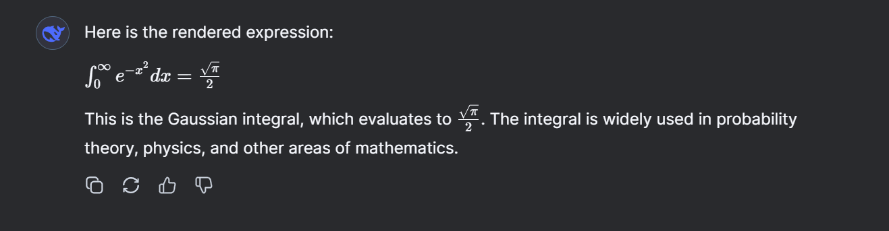

# Network Interception

Network Interception is one of IntenseRP Next's most significant improvements over traditional browser automation approaches. Instead of extracting responses from the rendered web page, it captures DeepSeek's responses directly from the network stream. This page explains how it works, why it's better, and what you need to know to use it effectively.

??? question "How do I actually use it?"
    If you're here for the quick answer, follow these steps:

    1. Open **Settings** in IntenseRP Next
    2. Go to the **DeepSeek Settings** section
    3. Enable **Intercept Network**
    4. Scroll down to **Advanced Settings**
    5. Make sure you have **Chrome** or **Edge** browser selected
    6. Save your settings
    7. Restart IntenseRP Next **completely** (close and reopen the app, make sure to wait for it to fully close before reopening)

## Understanding the Two Methods

IntenseRP Next offers two ways to capture responses from DeepSeek: the traditional DOM scraping method and the newer network interception approach. Understanding the difference helps explain why network interception provides a much better experience.

### The Traditional Way: DOM Scraping

With DOM scraping, the response journey looks like this:



This approach works, but it's like playing a game of telephone. The original markdown response gets transformed into HTML for display, then IntenseRP Next has to extract that HTML and convert it back to markdown. Each transformation can introduce errors or lose formatting details.

### The Better Way: Network Interception

Network interception takes a more direct route:



By intercepting the response at the network level, we capture exactly what DeepSeek sends before the browser transforms it for display. Basically, we avoid the middleman and get the raw markdown directly.

## What Makes It Better?

Network interception handles several scenarios significantly better than DOM scraping:

### Streaming Responses

With DOM scraping, streaming can be choppy because the browser continuously updates the HTML as new content arrives. Sometimes this causes the scraper to miss content or capture partial updates. Network interception receives the stream chunks directly as they arrive from DeepSeek, providing smooth, uninterrupted streaming.

### Complex Content

Code blocks are a perfect example of where network interception shines. When DeepSeek sends a code block, it arrives as clean markdown like this:

````markdown
```python
def hello_world():
    print("Hello from IntenseRP Next!")
```
````

But once the browser renders it, it becomes a complex HTML structure with syntax highlighting, line numbers, and copy buttons. DOM scraping has to parse all this HTML and try to reconstruct the original code block, which sometimes fails or produces mangled output.

---

Or, for another example, let's pick LaTeX. DeepSeek can send LaTeX math expressions like this:

```latex
$$\int_0^\infty e^{-x^2} dx = \frac{\sqrt{\pi}}{2}$$
```

When rendered in the browser with MathJax/KaTeX support, this becomes a beautifully formatted mathematical equation.



But DOM scraping has to extract the LaTeX from the HTML, which, with how dynamic it is, is nearly **impossible** to do reliably. Network interception captures the LaTeX directly as it was sent, in the raw form as you can see in the code block above.

### Special Features

Network interception also captures content that never makes it to the visible page. For example, when using DeepThink (R1 mode) with the "Send Thoughts" option enabled, the AI's reasoning process is wrapped in `<think>` tags. These tags are part of the network stream but get hidden by the browser's rendering. Network interception captures them perfectly, while DOM scraping can't see them at all.

### Performance

Since network interception doesn't wait for the browser to render content, it's noticeably faster. The response appears in SillyTavern almost immediately as DeepSeek generates it, rather than waiting for the browser to process and display it first.

## How It Works

Network interception uses the Chrome DevTools Protocol (CDP), the same technology that Chrome's developer tools use to inspect network traffic. Here's what happens behind the scenes:

When you enable network interception, IntenseRP Next loads a small Chrome extension that connects to CDP. This extension acts like a network monitor, watching for responses from DeepSeek's API endpoints. When it detects a streaming response, it captures each chunk of data and forwards it to IntenseRP Next through a local connection.

The extension is lightweight and only activates on DeepSeek's domain. It doesn't interfere with your normal browsing or collect any data beyond what's needed for IntenseRP Next to function.

## Browser Support

Network interception works with Chrome and Edge. Previously it was Chrome-only, but now both Chromium-based browsers are supported:

1. **CDP in Chromium browsers** - The Chrome DevTools Protocol is built into Chromium-based browsers. Both Chrome and Edge implement the same CDP specification, making network interception possible on both.

2. **Extension architecture** - Our network interception relies on Chromium's extension APIs and manifest v3 features. Firefox and Safari either don't support these APIs or implement them differently.

3. **Testing and reliability** - We've focused on making the Chrome/Edge implementation rock-solid rather than spreading our efforts across multiple browsers with varying quality.

Firefox has its own remote debugging protocol, but it would require a completely different implementation. Safari's extension system is even more different. Supporting these browsers is on our roadmap, but for now, we recommend using Chrome or Edge if you want network interception.

## Setup and Troubleshooting

Network interception should work automatically when you enable it in settings and use Chrome or Edge. The extension loads in the background without any manual installation needed.

If you're having issues, here are some things to check:

!!! tip "Quick Checks"
    - Make sure you're using Chrome or Edge (Firefox and Safari are not supported)
    - Check that "Intercept Network" is enabled in DeepSeek Settings
    - Look for any error messages in the console about extension loading
    - Try restarting IntenseRP Next if you just enabled the feature

The extension creates a fresh copy of itself each time IntenseRP Next starts to avoid Chrome's aggressive caching. Old copies are automatically cleaned up after a few hours. This approach ensures you're always running the latest version without manual updates.

## Technical Details

For those interested in the implementation details, here's how the system works under the hood:

### Extension Architecture

The network interception system consists of three main components:

1. **Background Service Worker** (`background.js`) - Manages the CDP connection and handles network events
2. **Content Script** (`content.js`) - Injected into DeepSeek pages to coordinate interception
3. **Local API Endpoints** - IntenseRP Next exposes endpoints for the extension to send captured data

### Data Flow

When DeepSeek sends a streaming response, it uses Server-Sent Events (SSE) to deliver chunks of JSON data. Each chunk contains either content updates or control events. The extension captures these chunks through CDP's `Network.dataReceived` event and forwards them to IntenseRP Next.

The captured data looks something like this:

```json
{
  "v": "Hello",
  "p": "response/content"
}
```

```json
{
  "v": ", how",
  "p": "response/thinking_content"
}
```

```json
{
  "v": " are you?",
  "p": "response/content"
}
```

Where `"p"` indicates the type of content, and `"v"` contains the actual text.

For thinking content in R1 mode:

```json
{
  "v": "Let",
  "p": "response/thinking_content"
}
```

```json
{
  "v": " me consider",
  "p": "response/thinking_content"
}
```

### Why CDP Instead of Fetch Interception?

You might wonder why we use CDP instead of simpler approaches like intercepting fetch requests.

The main reason is that DeepSeek itself has built-in protection against fetch interception. Apparently, it overrides the `fetch` API to prevent third-party scripts from capturing its responses. This means we can't rely on fetch interception alone.

Similarly, we cannot use `EventSource` interception, DeepSeek literally doesn't use that API.

## Future Improvements

While network interception already provides significant benefits, we have plans to make it even better:

- **Firefox implementation** - Creating a separate extension using Firefox's WebExtensions API
- **Guaranteed token delivery** - An intelligent optional system to make sure every token DeepSeek sends is captured, even if it fails to deliver in the expected order

The goal is to make network interception as transparent and reliable as possible, so you get the best experience without thinking about the technical details.

---

Frankly, network interception has been a game changer for IntenseRP Next in its current stage. Compared to the old DOM scraping method, it is much smoother, faster, and more reliable. In the near future, we hope to make it the default method for all DeepSeek interactions, much like DOM scraping currently is.