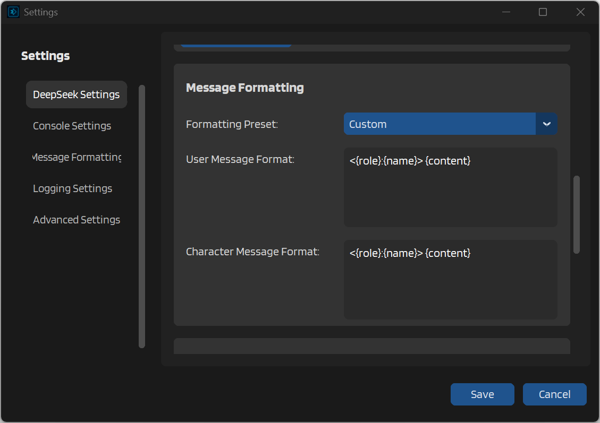

# Custom Formatting Templates

When the pre-defined templates don't quite fit your needs, IntenseRP Next lets you create your own formatting patterns. Custom templates give you complete control over how messages are structured when sent to DeepSeek.

To use custom templates, select **Custom** from the Formatting Preset dropdown in Settings. This will enable the template text fields below, where you can define your own patterns.

## Template Fields

When you select Custom formatting, you'll see two text areas:



**User Message Format** controls how messages from the user (or player) appear. This template is applied to all messages with the "user" role.

**Character Message Format** controls how messages from the AI character appear. This template is applied to all messages with the "assistant" role, plus any system messages.

## Available Variables

Your templates can include three variables that get replaced with actual content:

`{role}` - The literal API role (user, assistant, or system)  
`{name}` - The character or user name from your SillyTavern setup  
`{content}` - The actual message text

You can use any combination of these variables along with whatever text, punctuation, or formatting you want.

## Creating Your Templates

The most basic custom template might look like this:

```
{name}: {content}
```

This produces output identical to the Classic (Name) preset. But you can get creative with how you structure things.

Want to add some narrative flair? Try:

```
[{name} says] {content}
```

This would produce messages like:
```
[John says] Hello there, how are you today?
[Sarah says] I'm doing well, thank you for asking!
```

Need something that clearly marks the role for debugging? You could use:

```
<{role}:{name}> {content}
```

Which gives you:
```
<user:John> Hello there, how are you today?
<assistant:Sarah> I'm doing well, thank you for asking!
```

## Practical Examples

### Screenplay Format

For a screenplay or script-like feel:

User template: `{name} (V.O.): {content}`  
Character template: `{name}: {content}`

Result:
```
John (V.O.): I couldn't believe what I was seeing.
Sarah: Sometimes the truth is stranger than fiction.
```

### Markdown Headers

To make speakers stand out using markdown:

Both templates: `### {name}\n{content}`

Result:
```
### John
Hello there, how are you today?

### Sarah  
I'm doing well, thank you for asking!
```

### Timestamp Style

For a chat log appearance:

Both templates: `[{name}]: {content}`

Result:
```
[John]: Hello there, how are you today?
[Sarah]: I'm doing well, thank you for asking!
```

## Important Notes

Messages are separated by double newlines (`\n\n`) regardless of your template. You can't change the separator between messages - only how individual messages are formatted.

---

Your templates apply immediately when you save settings. There's no need to restart IntenseRP Next or reconnect to SillyTavern.

---

While you can add special characters or Unicode to your templates, keep in mind that DeepSeek needs to understand the format. Overly complex templates might confuse the AI or eat into your context limits.

---

!!! warning "Special Characters"
    Be careful with characters that might have special meaning in DeepSeek's training. Excessive use of angle brackets `< >`, pipes `|`, or other markup-like characters could trigger unexpected formatting behaviors.

## Tips for Good Templates

1. Keep templates relatively simple. The goal is to help DeepSeek understand who's speaking, not to create elaborate formatting.

2. Test your templates with a few messages before committing to a long roleplay session. Make sure DeepSeek responds appropriately and maintains the conversation flow.

3. If you use special formatting like markdown or pseudo-markup, be consistent. Use the same pattern for both user and character messages unless you have a specific reason to differentiate them.

4. Remember that every character in your template counts toward DeepSeek's context limit. Elaborate templates with lots of decoration can eat up valuable space that could be used for actual conversation.

!!! tip "Backing Up Templates"
    If you create a template you really like, consider copying it somewhere safe. While IntenseRP Next saves your templates with your other settings, it's always good to have a backup of your creative formatting work.