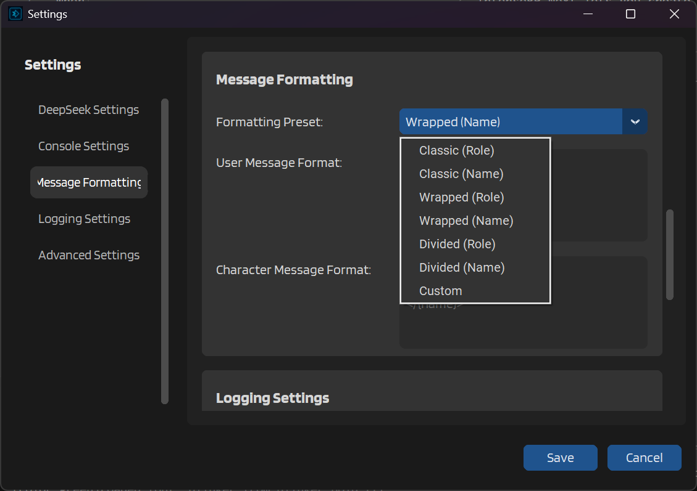

# Pre-Defined Formatting Templates

IntenseRP Next comes with several ready-to-use formatting templates that control how your messages appear when sent to DeepSeek. Each template has its own style, so you can pick the one that works best for your roleplay approach or DeepSeek's expected format.

You'll find these options in **Settings** → **Message Formatting** → **Formatting Preset**. The dropdown shows all available presets, each with either "(Role)" or "(Name)" in the title to indicate what it uses for labels.

## Role vs Name Templates

Before we look at specific templates, it's worth understanding the difference between Role and Name variants. Role templates use the literal API roles like "user" and "assistant" for labels. Name templates use the actual character names you've set up in SillyTavern. Most people prefer Name templates for roleplay since they make conversations feel more natural.

## Available Templates



### Classic (Role) and Classic (Name)

The Classic templates use the simplest format - just a label followed by a colon and the message content. If you've used AI chat interfaces before, this probably looks familiar.

With Classic (Role), messages look like:
```
user: Hello there, how are you today?
assistant: I'm doing well, thank you for asking!
```

With Classic (Name), the same conversation would show character names instead:
```
John: Hello there, how are you today?
Sarah: I'm doing well, thank you for asking!
```

Classic formatting works well for most situations. It's clean, easy to read, and DeepSeek handles it without any issues.

### Wrapped (Role) and Wrapped (Name)

The Wrapped templates use XML-style tags to clearly mark where each message begins and ends. This can help DeepSeek better understand message boundaries, especially in complex conversations.

With Wrapped (Role):
```xml
<user>
Hello there, how are you today?
</user>

<assistant>
I'm doing well, thank you for asking!
</assistant>
```

With Wrapped (Name):
```xml
<John>
Hello there, how are you today?
</John>

<Sarah>
I'm doing well, thank you for asking!
</Sarah>
```

Some users find that wrapped formatting helps maintain character consistency, particularly when messages contain multiple paragraphs or complex formatting.

### Divided (Role) and Divided (Name)

The Divided templates add visual separators between messages, making it extremely clear where one message ends and another begins. This can be helpful for long conversations or when messages contain lots of narrative text.

With Divided (Role):
```
----------- user -----------
Hello there, how are you today?
----------- ----------- -----------

----------- assistant -----------
I'm doing well, thank you for asking!
```

With Divided (Name):
```
----------- John -----------
Hello there, how are you today?
----------- ----------- -----------

----------- Sarah -----------
I'm doing well, thank you for asking!
```

While divided formatting creates the clearest visual separation, it does add quite a bit of extra text to your prompts. Consider this if you're working with DeepSeek's context limits.

# Choosing the Right Template

I don't recommend one template over another since it really depends on your personal preference and how DeepSeek responds to different formats. This depends on what kind of roleplay you're doing and how you want your characters to interact, or what pre-set you used in SillyTavern.

!!! tip "Testing Templates"
    Not sure which template works best? Try sending the same prompt with different formatting presets and see which produces better responses. What works best can vary depending on your specific characters and scenarios.

Remember that you can change the formatting preset at any time without restarting IntenseRP Next. The new format will apply to your next message and will not impact how it's displayed in SillyTavern.