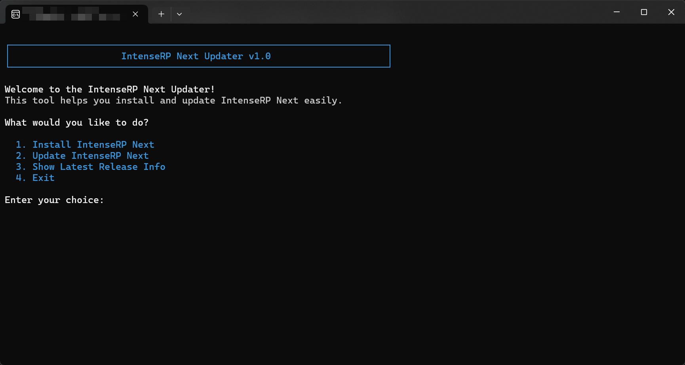

# IntenseRP Updater

As of version 1.2.0, IntenseRP Next distributions will now also bundle a small updater!

It's a simple CLI tool that helps you install and update IntenseRP Next faster, without having to go to the Releases page on GitHub every single time you want to check for updates or download the latest version.

!!! warning
    Right now, the updater only supports Windows (10+) systems. Linux support is being actively worked on.

## Download It

To download the updater, simply head over to the [Releases page](https://github.com/IntenseRP/IntenseRP-Next/releases) on GitHub and grab the latest version for your system.

Usually it's a simple zip of an executable alongside a small README.txt file.

!!! note
    Some browsers may block the download of the updater executable, so be sure to check your browser's download settings if you encounter any issues. Personally, I ran into this issue with Chrome, but switching to Firefox resolved it immediately (speaks volumes about accuracy).

## Installation

No install needed! It's a portable, one-file executable that you can run from anywhere you wish. However, it's NOT recommended to put it in the same place as your IntenseRP installation, because it's highly likely that it will try to delete itself during updates.

## Usage

The updater is a command line tool. You can either run it from PowerShell or double-click the file. A console window will open up either way.

You will be greeted with the updater's user interface, which has four options you can use by inserting their number in the console.

### 1. Install IntenseRP Next

- Select an installation directory
- Download the latest version
- Unpack the downloaded files
- Profit!

### 2. Update IntenseRP Next

- Select the `IntenseRP Next.exe` file
- Confirm the update
- Check if the app is currently running
- Check for existing saved data
- Backup the existing saved data
- Download the latest version
- Delete the old files
- Unpack the downloaded files
- Reintegrate your saved data
- Profit!

### 3. Show Latest Release Info

- Fetch the latest release information from GitHub
- Display the version number, release notes, and download links

### 4. Exit

- Close the updater

## Why Use the Updater?

The updater is designed to streamline the installation and update process for IntenseRP Next. By using the updater, you can:

- Save time by automating the download and installation process
- Never check for updates manually, let the updater handle it
- Easily manage backups and data reintegration

## SmartScreen / AV / Browser Block

It's not unexpected for this kind of software to be flagged by SmartScreen, antivirus programs, or browsers. It even makes sense in a way. It looks for a file, then deletes a directory, downloads more files, and modifies the existing installation. Viruses often do similar things, so these security measures are in place to protect users.

But in this case, the tool is fully open-source and safe. You can examine the code [here](https://github.com/IntenseRP/IntenseRP-Next) or even build it yourself if you don't trust it.