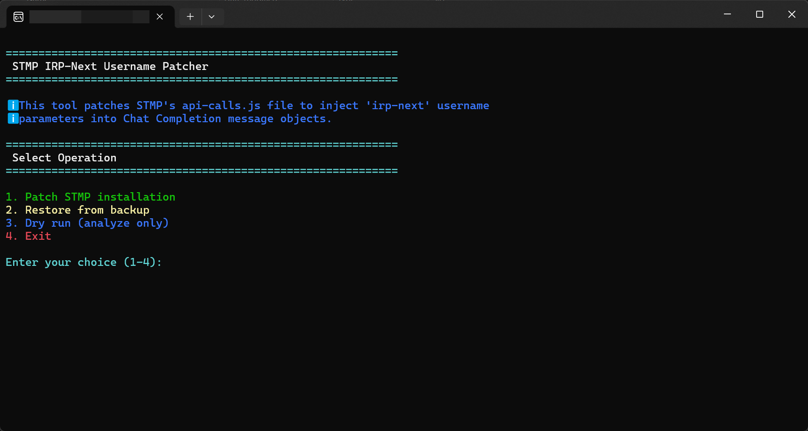

# STMP Integration Guide

SillyTavern Multiplayer (STMP) support brings multi-user roleplay to IntenseRP Next, letting multiple people chat with the same AI character simultaneously. Each user gets their own distinct identity, and IntenseRP Next automatically formats everything properly for DeepSeek to understand who's talking.

!!! tip "Quick Answer"
    **Already have STMP running?** Download the patcher from our [releases page](https://github.com/LyubomirT/intense-rp-next/releases), run it on your STMP directory, set IntenseRP Next to a **Name-based formatting preset**, and you're good to go!

## What is STMP?

[SillyTavern Multiplayer (STMP)](https://github.com/RossAscends/STMP) is a fantastic project by [RossAscends](https://github.com/RossAscends) that turns SillyTavern into a multiplayer experience. Instead of one person chatting with an AI character, multiple users can join the same conversation, each with their own identity and message history.

Think of it as Discord but with AI characters participating in the conversation. Each user types their messages, and STMP manages who said what, when, and makes sure everyone sees the full conversation flow.

STMP tracks user identities internally but doesn't normally include username information when making API calls to external services. That's exactly why our patcher is needed - it injects code that captures STMP's internal username data and includes it in messages sent to IntenseRP Next.

## Integration Overview

The integration process involves three main steps:

1. **Install and configure STMP** on your machine
2. **Patch STMP** using our specialized patcher tool to inject username parameters
3. **Configure IntenseRP Next** to use name-based formatting presets

Once set up, users connect to STMP just like they would under regular conditions, but IntenseRP Next receives enriched messages with user identification that gets properly formatted for DeepSeek.

!!! info "How It Works"
    STMP internally tracks which user sent each message, but doesn't include this information in standard API calls. Our patcher surgically modifies STMP's message construction code to inject an `irp-next` parameter containing the username. IntenseRP Next's character processor then detects these parameters and uses the actual usernames for formatting, so DeepSeek sees messages like "Alice: Hello!" instead of generic "user: Hello!" labels.

## Prerequisites

Before starting, make sure you have:

- **STMP installed and working** on your local machine
- **IntenseRP Next** installed and configured
- **Administrative/write permissions** for your STMP directory
- **STMP currently closed** (important for patching)

!!! warning "Close STMP First"
    Always close STMP completely before running the patcher. Having STMP running can interfere with the patching process and potentially corrupt files.

## Step-by-Step Integration

### Step 1: Install STMP

If you don't already have STMP installed:

1. **Download STMP** from the [official repository](https://github.com/RossAscends/STMP)
2. **Follow the STMP installation guide** to set it up on your machine
3. **Test STMP** to make sure it works with regular SillyTavern before proceeding
4. **Note the installation directory** - you'll need this for the patcher

Your STMP directory should contain `server.js` and a `src` folder with `api-calls.js` inside. If these files aren't present, the patcher won't be able to work.

### Step 2: Download the STMP Patcher

The STMP patcher is distributed as part of IntenseRP Next Utilities:

**Option A: Pre-built Executable (Recommended)**

1. Go to [IntenseRP Next releases](https://github.com/LyubomirT/intense-rp-next/releases)
2. Find the latest release and download the **IntenseRP Next Utilities** package for your platform:
   - Windows: `intenserp-next-utilities-win32-amd64.zip`  
   - Linux: `intenserp-next-utilities-linux-amd64.zip`
3. Extract the archive to a convenient location
4. You'll find `STMP-Patcher.exe` (Windows) or `stmp-patcher` (Linux) inside

**Option B: Run from Source**

If you prefer to run from source or need to modify the patcher:

1. Navigate to the `external/stmp-patcher/` directory in your IntenseRP Next installation
2. Run: `python stmp_patcher.py`
3. Requires Python 3.12+ installed

### Step 3: Run the Patcher

The patcher provides an interactive command-line interface that guides you through the process:

=== ":material-microsoft-windows: Windows"
    1. **Double-click** `STMP-Patcher.exe` to start the interactive interface
    2. The patcher will display a welcome screen and menu options
    
    
    
=== ":material-linux: Linux"
    1. **Open terminal** in the utilities directory
    2. **Make executable**: `chmod +x stmp-patcher`
    3. **Run**: `./stmp-patcher`

### Step 4: Follow the Patcher Prompts

The patcher will walk you through several steps:

#### 4a. Select Operation Mode

Choose from the main menu:

- **1. Patch STMP installation** - Apply the integration patches
- **2. Restore from backup** - Undo previous patches  
- **3. Dry run (analyze only)** - Test without making changes
- **4. Exit** - Quit the patcher

For first-time setup, choose **option 1** to patch your installation.

!!! tip "Try Dry Run First"
    If you're unsure about the process, try **option 3** first. This analyzes your STMP installation and shows exactly what would be modified without actually making changes.

#### 4b. Locate STMP Directory

The patcher will ask you to specify your STMP installation directory:

```
Enter STMP directory path: C:\Users\YourName\STMP
```

**The directory should contain:**

- `server.js` file in the root directory
- `src` folder containing `api-calls.js`

The patcher validates the directory structure automatically and will warn you if required files are missing.

#### 4c. Confirm Patching Operation

Before making changes, the patcher will show you exactly what it plans to modify:

```
About to patch the STMP installation
Continue? (y/n): y
```

Type `y` and press Enter to proceed.

#### 4d. Watch the Progress

The patcher uses pattern analysis to locate and modify the correct code sections. Would be much simpler without licensing issues, but here it is:

```
[1] Analyzing newObj assignment patterns
✓ Found 3 patchable patterns

[2] Generating patch insertion points  
✓ Generated 3 insertion points

[3] Applying modifications
✓ STMP patching completed successfully!
✓ Patched 3 patterns
✓ Made 3 insertions
✓ Backup created: C:\Users\YourName\STMP\src\api-calls.js.irp-backup
```

### Step 5: Save the Backup (Optional but Recommended)

The patcher automatically creates a backup file with the `.irp-backup` suffix. Consider copying this to a safe location:

**Backup location**: `[STMP directory]/src/api-calls.js.irp-backup`

This backup lets you restore the original STMP functionality if needed, either using the patcher's restore function or by manually renaming the backup file.

!!! success "Patching Complete"
    If you see success messages like above, the patching is complete! STMP is now ready to work with IntenseRP Next.

### Step 6: Configure IntenseRP Next Formatting

Now that STMP is patched, configure IntenseRP Next to use the username information:

1. **Open IntenseRP Next Settings**
2. **Navigate to** → **Message Formatting** → **Formatting Preset**
3. **Choose a Name-based preset** from the dropdown:

    - **Classic (Name)** - Simple "Username: message" format *(recommended)*
    - **Wrapped (Name)** - XML-style `<Username>message</Username>` format
    - **Divided (Name)** - Visual separators with usernames
    - **Custom** - Use custom templates with `{name}` variables

!!! important "Use Name-Based Presets"
    **Role-based presets** (Classic (Role), Wrapped (Role), etc.) won't show individual usernames. Make sure to choose a **(Name)** variant for proper STMP integration.

For most users, **Classic (Name)** provides the cleanest and most natural formatting that works well with DeepSeek.

### Step 7: Test the Integration

Time to test everything works together:

1. **Start STMP** on your machine
2. **Start IntenseRP Next** and connect it to STMP's API endpoint
3. **Have multiple users connect** to your STMP instance
4. **Send messages from different users** and verify that:
   - Each user's name appears correctly in the conversation
   - DeepSeek responses acknowledge the different speakers appropriately
   - The conversation flow feels natural with multiple participants

!!! example "What Success Looks Like"
    Instead of seeing generic messages like:
    ```
    user: Hello there!
    user: How's everyone doing?
    ```
    
    You should see distinct usernames:
    ```
    Alice: Hello there!
    Bob: How's everyone doing?
    ```
    
    And DeepSeek will respond appropriately to each person individually.

## Advanced Configuration

### Custom Formatting Templates

If you use **Custom** formatting presets, make sure your templates include the `{name}` variable:

**Custom User Template**: `{name}: {content}`
**Custom Character Template**: `{name}: {content}`

You can also create more elaborate templates:
```
**{name} says:** {content}
```

### Troubleshooting Integration Issues

??? question "Names not appearing correctly"
    **Check your formatting preset** - make sure you're using a (Name) variant, not a (Role) variant.
    
    **Verify the patch worked** - messages should include an `irp-next` parameter when sent to IntenseRP Next. A great idea to check is by checking STMP logs.

??? question "Some users show as 'User' instead of their name"
    This usually means the patcher didn't fully complete or STMP wasn't properly restarted after patching.
    
    **Try these steps:**

    1. Stop STMP completely
    2. Run the patcher's **restore** operation
    3. Run the **patch** operation again
    4. Restart STMP

??? question "Messages appear duplicated or malformed"
    **Check STMP version compatibility** - the patcher is designed for standard STMP installations. Heavily modified versions might have different code patterns.
    
    **Use the dry run mode** to see what the patcher detects in your installation.

??? question "Patcher says 'no patchable patterns found'"
    This usually means either:
    
    - **STMP is already patched** - try the restore operation first
    - **STMP version is unsupported** - the code structure might be different
    - **Wrong directory** - make sure you're pointing to the correct STMP installation

## Technical Details

### What the Patcher Actually Does

The STMP patcher performs surgical modifications to JavaScript code using pattern-based analysis:

**Target File**: `[STMP directory]/src/api-calls.js`

**Pattern Detection**: Searches for `newObj` assignment patterns that create Chat Completion message objects

**Code Injection**: Adds `'irp-next': obj.username` properties to message objects, not touching existing JavaScript syntax

**Safety Features**: Creates automatic backups, validates file structure, and provides detailed error reporting

### How IntenseRP Next Handles STMP Messages

When STMP sends messages to IntenseRP Next:

1. **Message Parsing**: The `Message.from_dict()` method extracts both `name` and `irp-next` parameters
2. **Character Processing**: The `CharacterProcessor` detects and stores user names from messages  
3. **Formatting**: Name-based presets use the actual usernames instead of generic "user" labels
4. **API Formatting**: Final message content shows distinct user identities to DeepSeek

### Pattern-Based Approach

The patcher uses a pattern-based approach rather than semantic code analysis to avoid licensing issues:

- **No code embedding** - doesn't include STMP code in IntenseRP Next
- **Text transformation** - treats JavaScript as plain text for surgical modifications  
- **Pattern matching** - uses regex to identify code structures without understanding semantics
- **Preserves formatting** - maintains original code style and structure

## Compatibility Notes

### STMP Version Support

The patcher is designed to work with **standard STMP installations** that contain:

- `server.js` file in root directory
- `src/api-calls.js` with standard message handling patterns
- Standard JavaScript object literal message construction

### Recovery Options

If something goes wrong, you have several recovery options:

**Option 1**: Use the patcher's restore function
```
1. Run the patcher
2. Select "2. Restore from backup"
3. Point to your STMP directory
4. Confirm the restore operation
```

**Option 2**: Manual file restoration
```
1. Navigate to [STMP directory]/src/
2. Delete or rename api-calls.js
3. Rename api-calls.js.irp-backup to api-calls.js
```

**Option 3**: Download the file again
As weird as it sounds, you can simply go to the [STMP repository](https://github.com/RossAscends/STMP) and download the original `api-calls.js` file.

### Useful Resources

- **STMP Documentation**: [Official STMP repository](https://github.com/RossAscends/STMP)
- **IntenseRP Next Features**: [Formatting Templates](../features/formatting-templates/pre-defined-templates.md)
- **Troubleshooting**: [General troubleshooting guide](../welcome/quick-start-guide/if-it-didnt/troubleshooting.md)