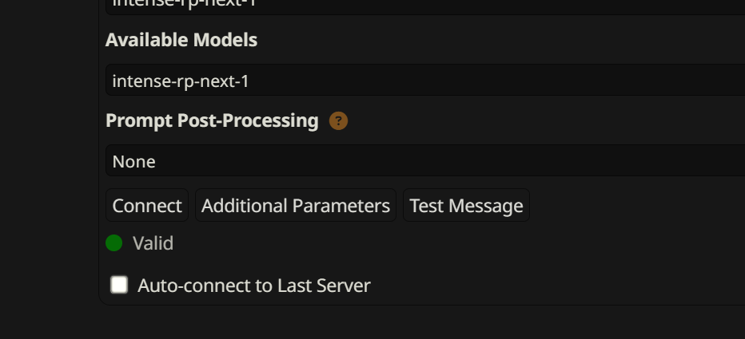

# API Key Authentication

IntenseRP Next includes optional API key authentication to secure your API endpoints from unauthorized access. This is particularly useful when exposing your instance to the network or when you want to make sure only trusted clients can connect to your DeepSeek bridge.

!!! tip "When to Use API Keys"
    API key authentication is recommended when you enable the **Show IP** feature in Advanced Settings, which makes your IntenseRP Next instance accessible from other devices on your network. It's also a good security practice if you're using IntenseRP Next in shared environments.

## How It Works

When API key authentication is enabled, all requests to the main API endpoints must include a valid Bearer token in the Authorization header. Without a valid API key, requests will be rejected with a `401 Unauthorized` response.

The protected endpoints are:

- `GET /models` - Returns the list of available models (currently just the virtual one)
- `POST /chat/completions` - Main chat completion endpoint for SillyTavern communication

Other utility endpoints (like network interception endpoints used by the Chrome extension) are not protected by API key authentication since they're only used internally by IntenseRP Next.

## Setting Up API Key Authentication

### :material-cog: Enable Authentication

1. Open IntenseRP Next settings
2. Navigate to **Security Settings**
3. Toggle **Enable API Authentication** to ON

When enabled, you will be able to use these two additional features:

### :material-format-list-text: Managing API Keys

The **API Keys** textarea allows you to manage all valid API keys for your instance. Each key should be on its own line:

```
intense-a1b2c3d4e5f6g7h8i9j0k1l2m3n4o5p6
intense-x9y8z7w6v5u4t3s2r1q0p9o8n7m6l5k4
intense-m5n6o7p8q9r0s1t2u3v4w5x6y7z8a9b0
```

You can add keys manually if you have them from another source, but the easiest way is to use the built-in generator.

### :material-plus-circle: Generating New API Keys

Click the **Generate API Key** button to create a new secure API key. The system will:

1. Generate a cryptographically secure random key using the format `intense-<32_random_characters>`
2. Automatically add it to your API Keys list
3. Save the updated configuration

!!! info "API Key Format"
    All **generated** IntenseRP Next API keys follow the format `intense-` followed by 32 random alphanumeric characters. This doesn't apply to manually added keys, which can be any string you choose as long as it's longer than 16 characters and unique.

### :material-content-copy: Using API Keys

Once you have API keys configured, you'll need to update your SillyTavern connection settings:

1. In SillyTavern, go to **API Connections**
2. Find your IntenseRP Next connection (usually `Custom (OpenAI-compatible)`)
3. In the **API Key** field, enter one of your generated API keys
4. Save the settings

SillyTavern will automatically include the API key as a Bearer token in all requests to IntenseRP Next.

## Things to Note

### :material-shield-check: Best Practices

!!! important "Association"
    Currently, a new feature to associate names with API keys is being worked on for you to recognize better which key belongs to which user or application. Until then, it's a good idea to keep a separate record of what each key is used for.

- Keep your API keys secret - treat them like passwords (because they literally are!)
- Regularly rotate keys if you suspect they may have been compromised
- Remove unused keys from the API Keys list to reduce risk

### :material-network: Network Security

API key authentication is only application-level security, you should also consider going beyond that if you plan to expose your IntenseRP Next instance to the internet or a wider network:

- **Use trusted networks only** when enabling network access
- **Consider firewall rules** to restrict which devices can reach your IntenseRP Next instance
- **Monitor your console output** for unauthorized access attempts

!!! warning "Key Storage"
    API keys are stored in IntenseRP Next's encrypted configuration file alongside other sensitive settings like your DeepSeek credentials. The configuration uses Fernet encryption to protect stored data.

## Troubleshooting API Key Issues

### :material-alert-circle: Common Error Messages

**Missing Authorization header** (not very common)
```json
{
    "error": {
        "message": "Missing Authorization header. Please provide Bearer token.",
        "type": "authentication_error",
        "code": "missing_authorization"
    }
}
```

**Solution**: Check if you have an API key set for IntenseRP Next in SillyTavern. If you do, ensure it's correctly entered in the API Key field. If not, generate a new key and update your settings.

**Invalid Authorization header format**
```json
{
    "error": {
        "message": "Invalid Authorization header format. Use: Authorization: Bearer <your-api-key>",
        "type": "authentication_error", 
        "code": "invalid_authorization_format"
    }
}
```

**Solution**: Usually also happens when the API key is not set correctly in SillyTavern. Verify that the API key field actually contains a valid key you set in IntenseRP Next settings.

**Invalid API key**
```json
{
    "error": {
        "message": "Invalid API key. Please check your Bearer token.",
        "type": "authentication_error",
        "code": "invalid_api_key"
    }
}
```

**Solution**: The provided API key doesn't match any keys in your configured list. Check that:

- The API key is correctly copied from IntenseRP Next settings
- The key hasn't been removed from the API Keys list
- There are no extra spaces or characters

### :material-tools: Testing API Keys

Most of the time, the `Connect` button in SillyTavern will try to connect using the API key you provided and fetch the list of models. If it fails, it will show an error message indicating the issue or "bypass the status check".



---

If you're feeling hacky, you can also test API key authentication using command-line tools like `curl` or Postman. This allows you to manually send requests with your API key and see the raw responses.

You can test API key authentication using a simple curl command:

```bash
curl -H "Authorization: Bearer your-api-key-here" http://127.0.0.1:5000/models
```

Replace `your-api-key-here` with one of your actual API keys. A successful response (usually 200) indicates the key is working correctly.

## Disabling API Key Authentication

To disable API key authentication:

1. Open IntenseRP Next settings
2. Navigate to **Security Settings**  
3. Toggle **Enable API Authentication** to OFF
4. Save settings

Once disabled, all API requests will be accepted without authentication. The API Keys list and Generate button will be visible nonetheless but will not be used for authentication, nor will they be verified.

!!! tip "Temporary Disable"
    If you're troubleshooting connection issues, temporarily disabling API key authentication can help determine if the keys are the source of the problem.

## Integration with Other Features

### :material-ip-network: Network Access

API key authentication pairs perfectly with the **Show IP** feature in Advanced Settings. When both are enabled:

- Your IntenseRP Next instance is accessible from other devices on your network
- Only clients with valid API keys can use the DeepSeek bridge functionality
- You get the convenience of network access with the security of authentication

---

Soon enough, we will also add support for IP whitelisting, associations (see above), and Cloudflare tunnel integration to improve security even further.