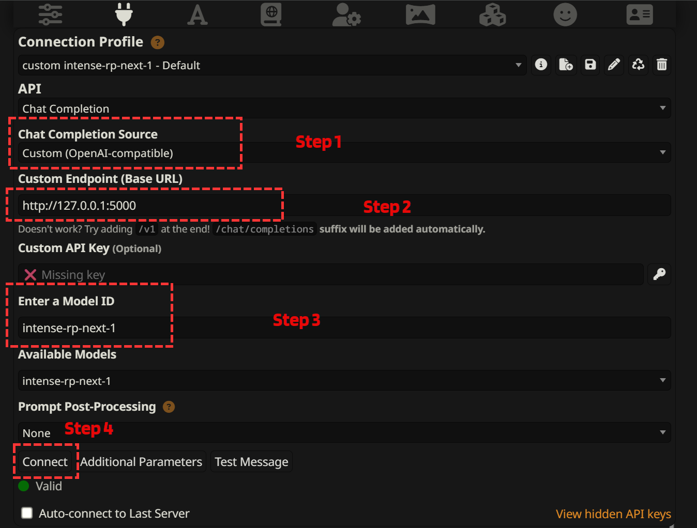

# Connect to SillyTavern

After installing IntenseRP Next and configuring your basic settings, it's time to connect it to SillyTavern. This guide will walk you through launching the bridge, connecting SillyTavern to it, and understanding the various connection options.

## Starting the Bridge

### Step 1: Launch IntenseRP Next

Open IntenseRP Next by double-clicking the executable (`IntenseRP Next.exe` on Windows) or running it from the command line if you built from source.

### Step 2: Start the Service

Once the application opens, click the **Start** button. This will:

1. Open a browser window (Chrome, Firefox, or Edge, depending on your settings)
2. Navigate to DeepSeek's website
3. Initialize the local API server (default port 5000, configurable in settings)

!!! info "Browser Login"
    If this is your first time running IntenseRP Next (or you haven't enabled persistent cookies), you'll need to log in to DeepSeek when the browser opens. If you configured auto-login in the settings, this will happen automatically.

### Step 3: Wait for Confirmation

The textbox in the main window will display status messages. Wait until you see:

```
API IS NOW ACTIVE!
WELCOME TO INTENSE RP API
URL 1: http://127.0.0.1:5000/
```

!!! note "Port Configuration"
    The default port is 5000, but this can be changed in **Settings** → **Advanced Settings** → **Network Port** if needed (for example, if another application is using port 5000).

If you enabled the "Show IP" option in settings, you'll also see a second URL with your local network IP address, which is useful for connecting from other devices on your network.

!!! success "Ready to Connect"
    When you see the URLs listed, the bridge is active and ready for SillyTavern to connect.

## Connecting from SillyTavern

### Step 1: Open API Settings in SillyTavern

In SillyTavern, go to **API Connections** (the plug icon in the left sidebar).

### Step 2: Configure the Connection

In the API settings:

1. For **Chat Completion Source**, select **Custom (OpenAI-compatible)**
2. For **Custom Endpoint**, enter `http://127.0.0.1:5000/`
   - If you changed the port in IntenseRP Next, use that port number instead of 5000.
3. Leave **API Key** blank (not needed for IntenseRP Next)
4. Click **Connect**



### Step 3: Verify Connection

If the connection is successful, you'll see a green "Connected" status in SillyTavern, and the available model will be shown as `intense-rp-next-1` or similar.

## Character Name and User Name Parameters

IntenseRP Next supports special parameters that let you control character and user names in the conversation:

### Option 1: Using DATA1 and DATA2 in System Prompt

You can set the character and user names by adding these lines to your character's system prompt:

```
DATA1: "{{char}}"
DATA2: "{{user}}"
```

The `{{char}}` and `{{user}}` placeholders will be replaced with the character and persona names you set in SillyTavern and is handled automatically by it. This is the recommended way to ensure proper formatting in conversations.

### Option 2: Using API Parameters (Advanced, Experimental, and Likely Unnecessary)

If you're using custom API parameters in SillyTavern, you can set these directly:

```json
{
  "char_name": "{{char}}",
  "user_name": "{{user}}"
}
```

!!! tip "Why Use These Parameters?"
    Setting explicit character and user names helps IntenseRP Next properly format messages when sending them to DeepSeek, especially in more complex conversation formats.

## SillyTavern MultiPlayer (STMP) Support

[STMP by RossAscends](https://github.com/RossAscends/STMP) uses `name` parameters to identify characters and different players. IntenseRP Next supports this by automatically detecting the `name` parameter in messages and using it to format responses correctly. This likely requires no setup on your part.

## Network Interception vs DOM Scraping

IntenseRP Next offers two methods for capturing responses from DeepSeek:

### Network Interception (Recommended)

Network interception uses a Chrome/Edge extension to capture responses directly from the network traffic, before they're rendered on the page. This method:

- Works only with Chrome/Edge browsers
- Provides more reliable streaming responses
- Handles more complex content like code blocks, images, and LaTeX
- Captures responses faster and more consistently

To enable network interception, go to Settings and turn on **Intercept Network** in the DeepSeek Settings section.

### DOM Scraping (Default)

DOM scraping extracts responses from the rendered HTML on the page. This method:

- Works with all supported browsers (Chrome, Firefox, Edge)
- Is more compatible across different operating systems
- May have occasional issues with complex formatting or code blocks
- Is slightly slower but still works well for most uses
- Known to be drastically less reliable than network interception for complex presets

This is the default method if network interception is disabled. In the original IntenseRP, this was the only method available.

## Local vs Network Access

By default, IntenseRP Next is only accessible from the same device (via `127.0.0.1` or `localhost`). If you want to access it from other devices on your network:

1. Enable the **Show IP** setting in IntenseRP Next
2. Use the second URL that appears when you start the service (something like `http://192.168.x.x:5000/`)
3. Make sure your firewall allows connections to the configured port (default 5000)

!!! warning "Security Note"
    When allowing network access, remember that anyone on your local network could potentially connect to your IntenseRP Next instance. Don't enable this in untrusted network environments.

## Special Message Parameters

IntenseRP Next supports special directives in your messages:

- Add `{{r1}}` or `[r1]` anywhere in your message to enable DeepSeek's V3.1 Think reasoning mode (deepthink)
- Add `{{search}}` or `[search]` to enable web search for that message

Example:
```
{{r1}} *Superhero approaches the floating code block*
What kind of powers does it have? I have never seen anything like... `import antigravity` before.
```

These directives will be automatically removed from the final message sent to DeepSeek.

Optionally, you can enable those settings globally in the DeepSeek Settings section of IntenseRP Next, so you don't have to add them manually each time. If you do this, Search and/or DeepThink will be applied to all messages sent to DeepSeek regardless of whether you include the tags.

## Checking Connection Status

To verify everything is working correctly:

1. The browser window should show DeepSeek's chat interface
2. IntenseRP Next's main window should show "API IS NOW ACTIVE!"
3. SillyTavern should show "Connected" with the IntenseRP Next model

If something isn't working, check the [Troubleshooting](if-it-didnt/troubleshooting.md) section for common solutions.

---

Once your connection is established, you're ready to start chatting! Head over to [Try out more features](if-it-worked/try-out-more-features.md) to learn about advanced options and get the most out of IntenseRP Next.